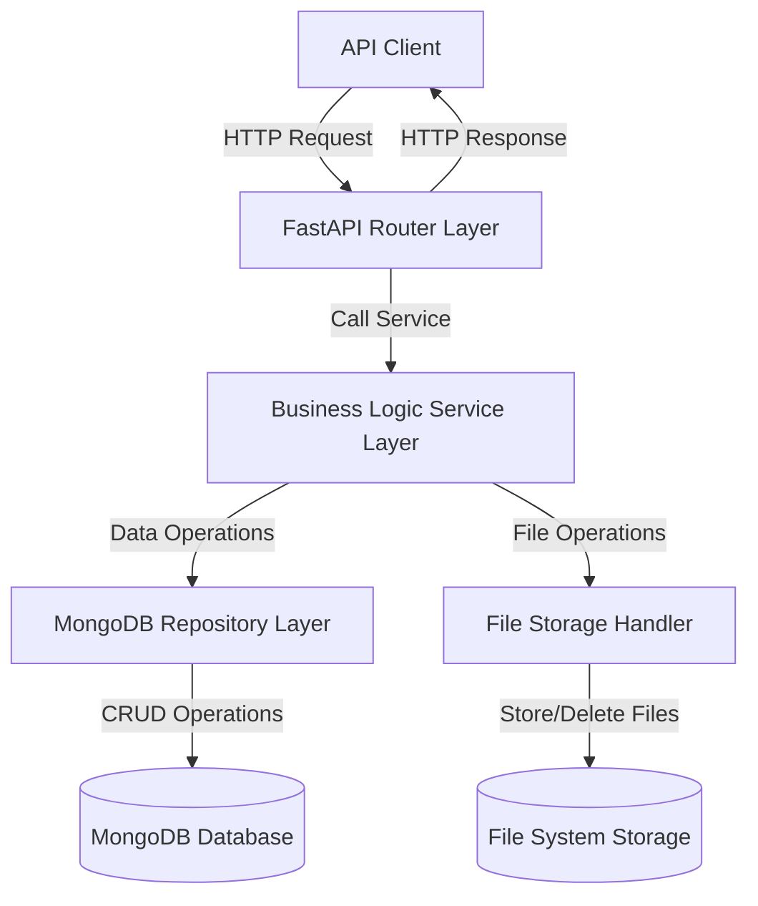

# Technical Design Document

## Overview

This document provides the technical design for a FastAPI-based REST API that manages user records in MongoDB. The system implements a layered architecture separating HTTP handling, business logic, and database operations. The API exposes CRUD endpoints for user management along with dedicated endpoints for profile photo upload and update operations.

### Key Technical Decisions

1. **FastAPI Framework**: Chosen for native async/await support, automatic OpenAPI documentation generation, and Pydantic-based data validation
2. **Motor Driver**: Async MongoDB driver that integrates seamlessly with FastAPI's async request handlers
3. **Layered Architecture**: Separation of concerns through distinct router, service, and repository layers
4. **Pydantic Models**: Type-safe request/response validation with automatic OpenAPI schema generation
5. **File System Storage**: Profile photos stored on local file system with URL references in MongoDB documents

### Design Goals

- Provide intuitive RESTful endpoints following HTTP conventions
- Deliver comprehensive validation feedback with detailed error messages
- Handle database connection failures gracefully with retry logic
- Support async operations throughout the request lifecycle
- Generate interactive API documentation automatically

## Architecture

### System Components



### Layer Responsibilities

**Router Layer** (`routers/user_router.py`)
- Accept HTTP requests and extract parameters
- Delegate business logic to service layer
- Transform service responses to HTTP responses
- Handle HTTP-specific concerns (status codes, headers)

**Service Layer** (`services/user_service.py`)
- Implement business logic and validation rules
- Coordinate between repository and file storage
- Handle unique constraint checks (employee_id)
- Orchestrate multi-step operations (e.g., photo replacement)

**Repository Layer** (`repositories/user_repository.py`)
- Provide async CRUD operations for MongoDB
- Handle database-specific error translation
- Manage connection pool and retry logic
- Abstract MongoDB implementation details

**File Storage Handler** (`services/file_handler.py`)
- Validate file types and sizes
- Generate unique file names to prevent collisions
- Store and delete files from file system
- Return file URLs for database storage

### Request Flow Examples

**Create User Flow:**
1. Client sends POST /users with JSON body
2. Router extracts and validates request via Pydantic model
3. Service checks employee_id uniqueness
4. Repository creates document in MongoDB
5. Service returns created user
6. Router transforms to 201 response

**Upload Photo Flow:**
1. Client sends POST /users/{id}/photo with multipart form data
2. Router validates user_id format and file presence
3. Service verifies user exists in database
4. FileHandler validates file type and size, stores file
5. If user already has a photo, delete old photo file from storage
6. Repository updates user document with photo URL
7. Router returns 200 with updated user

## Components and Interfaces

### Data Models

**User Document Schema (MongoDB)**
```python
{
    "_id": ObjectId,              # MongoDB generated ID
    "user_name": str,             # Max 100 characters
    "address": str,               # Max 500 characters
    "employee_id": str,           # Max 50 characters, unique index
    "salary": float,              # Must be greater than 0
    "gender": str,                # Values: "Male", "Female", "Other"
    "joining_date": str,          # ISO 8601 date format (YYYY-MM-DD)
    "active_status": bool,        # Employee active flag
    "profile_photo_url": str      # Optional, URL to stored file
}
```

**Pydantic Models**

```python
# Request Models
class UserCreate(BaseModel):
    user_name: str = Field(..., max_length=100)
    address: str = Field(..., max_length=500)
    employee_id: str = Field(..., max_length=50)
    salary: float = Field(..., gt=0)
    gender: Literal["Male", "Female", "Other"]
    joining_date: date  # Validates ISO 8601 and semantic validity
    active_status: bool

class UserUpdate(BaseModel):
    user_name: Optional[str] = Field(None, max_length=100)
    address: Optional[str] = Field(None, max_length=500)
    employee_id: Optional[str] = Field(None, max_length=50)
    salary: Optional[float] = Field(None, gt=0)
    gender: Optional[Literal["Male", "Female", "Other"]] = None
    joining_date: Optional[date] = None
    active_status: Optional[bool] = None

# Response Models
class UserResponse(BaseModel):
    id: str = Field(..., alias="_id")  # MongoDB ObjectId as string
    user_name: str
    address: str
    employee_id: str
    salary: float
    gender: str
    joining_date: str  # ISO 8601 date string
    active_status: bool
    profile_photo_url: Optional[str] = None

class ErrorDetail(BaseModel):
    field: str
    message: str

class ValidationErrorResponse(BaseModel):
    detail: List[ErrorDetail]

class DeleteResponse(BaseModel):
    id: str
    message: str
```

### API Endpoints

**User CRUD Operations**

| Method | Endpoint | Request Body | Response | Status Codes |
|--------|----------|--------------|----------|--------------|
| POST | `/users` | `UserCreate` | `UserResponse` | 201, 409, 422, 503 |
| GET | `/users/{id}` | None | `UserResponse` | 200, 404, 422, 503 |
| GET | `/users` | None | `List[UserResponse]` | 200, 400, 503 |
| PUT | `/users/{id}` | `UserUpdate` | `UserResponse` | 200, 404, 409, 422, 503 |
| DELETE | `/users/{id}` | None | `DeleteResponse` | 200, 404, 422 |

**Photo Operations**

| Method | Endpoint | Request Body | Response | Status Codes |
|--------|----------|--------------|----------|--------------|
| POST | `/users/{id}/photo` | Multipart: `file` field | `UserResponse` | 200, 404, 413, 422, 500 |

**Documentation Endpoints**

| Method | Endpoint | Response | Status Codes |
|--------|----------|----------|--------------|
| GET | `/docs` | Swagger UI HTML | 200, 500 |
| GET | `/redoc` | ReDoc UI HTML | 200, 500 |

### Service Interfaces

**UserService**
```python
class UserService:
    async def create_user(self, user_data: UserCreate) -> UserResponse:
        """Create new user after validating employee_id uniqueness"""
        
    async def get_user_by_id(self, user_id: str) -> UserResponse:
        """Retrieve single user by MongoDB ObjectId"""
        
    async def get_all_users(self) -> List[UserResponse]:
        """Retrieve all users"""
        
    async def update_user(self, user_id: str, user_data: UserUpdate) -> UserResponse:
        """Update user with partial data, validating employee_id uniqueness"""
        
    async def delete_user(self, user_id: str) -> DeleteResponse:
        """Delete user by MongoDB ObjectId"""
        
    async def manage_photo(self, user_id: str, file: UploadFile) -> UserResponse:
        """Upload or replace profile photo, cleaning up old file if it exists"""
```

**UserRepository**
```python
class UserRepository:
    async def create(self, user_data: dict) -> dict:
        """Insert user document into MongoDB"""
        
    async def find_by_id(self, user_id: str) -> Optional[dict]:
        """Find user document by ObjectId"""
        
    async def find_by_employee_id(self, employee_id: str) -> Optional[dict]:
        """Find user document by employee_id field"""
        
    async def find_all(self) -> List[dict]:
        """Retrieve all user documents"""
        
    async def update(self, user_id: str, update_data: dict) -> Optional[dict]:
        """Update user document and return updated version"""
        
    async def delete(self, user_id: str) -> bool:
        """Delete user document, return True if deleted"""
```

**FileHandler**
```python
class FileHandler:
    ALLOWED_EXTENSIONS = {".jpg", ".jpeg", ".png", ".webp"}
    MAX_FILE_SIZE = 5 * 1024 * 1024  # 5MB
    
    async def save_file(self, file: UploadFile) -> str:
        """Validate and save file, return URL"""
        
    async def delete_file(self, file_url: str) -> bool:
        """Delete file from storage, return success status"""
        
    def validate_file_type(self, filename: str) -> bool:
        """Check if file extension is allowed"""
        
    async def validate_file_size(self, file: UploadFile) -> bool:
        """Check if file size is within limits"""
```

## Data Models

### MongoDB Collection: `users`

**Indexes:**
- `_id`: Primary key (default MongoDB index)
- `employee_id`: Unique index for enforcing employee ID uniqueness

**Document Structure:**
```python
{
    "_id": ObjectId("507f1f77bcf86cd799439011"),
    "user_name": "John Doe",
    "address": "123 Main St, Springfield, IL 62701",
    "employee_id": "EMP001",
    "salary": 75000.50,
    "gender": "Male",
    "joining_date": "2024-01-15",
    "active_status": true,
    "profile_photo_url": "/uploads/507f1f77bcf86cd799439011_profile.jpg"
}
```

### File Storage Structure

Profile photos stored in `uploads/` directory with naming pattern:
```
uploads/{user_id}_profile_{timestamp}.{extension}
```

Example: `uploads/507f1f77bcf86cd799439011_profile_1704067200.jpg`

### Error Response Formats

**Validation Error (422)**
```json
{
    "detail": [
        {
            "field": "salary",
            "message": "ensure this value is greater than 0"
        },
        {
            "field": "joining_date",
            "message": "invalid date format, expected YYYY-MM-DD"
        }
    ]
}
```

**Conflict Error (409)**
```json
{
    "detail": [
        {
            "field": "employee_id",
            "message": "employee_id 'EMP001' already exists"
        }
    ]
}
```

**Not Found Error (404)**
```json
{
    "detail": "User with id '507f1f77bcf86cd799439011' not found"
}
```

**Service Unavailable (503)**
```json
{
    "detail": "Database connection unavailable, please retry"
}
```

## Error Handling

### Error Categories and Handling Strategy

**1. Validation Errors (422 Unprocessable Entity)**

Triggered by:
- Invalid data types (e.g., string for salary field)
- Missing required fields
- Values outside allowed ranges (salary < 0.01 or > 999999999.99)
- Invalid date formats or semantically invalid dates
- Gender values not in allowed set
- Invalid MongoDB ObjectId format
- Unsupported file types or sizes exceeding limits

Handling:
- FastAPI and Pydantic automatically catch and format validation errors
- Custom validators for complex rules (date range, decimal places)
- Return all validation errors in a single response for better UX
- Structure: `{"detail": [{"field": "...", "message": "..."}]}`

**2. Conflict Errors (409 Conflict)**

Triggered by:
- Attempting to create user with existing employee_id
- Attempting to update user with employee_id that belongs to another user

Handling:
- Service layer checks for existing employee_id before create/update
- Query repository for conflicting employee_id
- Return specific error identifying the conflicting field and value
- Structure: `{"detail": [{"field": "employee_id", "message": "employee_id 'X' already exists"}]}`

**3. Not Found Errors (404 Not Found)**

Triggered by:
- GET /users/{id} with non-existent user_id
- PUT /users/{id} with non-existent user_id
- DELETE /users/{id} with non-existent user_id
- Photo operations on non-existent user_id

Handling:
- Repository returns None for missing documents
- Service layer raises HTTPException with 404 status
- Include the requested ID in error message
- Structure: `{"detail": "User with id 'X' not found"}`

**4. Request Entity Too Large (413)**

Triggered by:
- File uploads exceeding 5MB size limit

Handling:
- FileHandler validates file size before processing
- Check file size using `await file.read()` length
- Return error before attempting storage
- Structure: `{"detail": "File size exceeds maximum allowed size of 5MB"}`

**5. Database Connection Errors (503 Service Unavailable)**

Triggered by:
- MongoDB connection failure during request
- Connection pool exhausted
- Network timeout to MongoDB

Handling:
- Repository layer catches PyMongo exceptions (ConnectionFailure, ServerSelectionTimeout)
- Implement retry logic with exponential backoff (1s, 2s, 4s)
- After 3 failed retries, raise HTTPException with 503
- Log all connection errors with timestamps
- Structure: `{"detail": "Database connection unavailable, please retry"}`

**6. File Storage Errors (500 Internal Server Error)**

Triggered by:
- Disk full or permission denied when saving files
- File system errors during photo management
- Corrupted or unreadable image files

Handling:
- FileHandler catches IOError and OSError exceptions
- For photo management: if old file deletion fails, log error but proceed with new file storage
- If new file storage fails, return 500 error
- Include generic error message without exposing internal paths
- Structure: `{"detail": "File storage operation failed"}`


### Error Logging Strategy

All errors should be logged with the following information:
- Timestamp (ISO 8601 format)
- Request ID (generated UUID for tracking)
- Endpoint and HTTP method
- Error type and message
- Stack trace for 500-level errors
- User-facing error message

Example log entry:
```
2024-01-15T10:30:45.123Z [ERROR] request_id=abc-123 method=POST endpoint=/users error=ConflictError message="employee_id 'EMP001' already exists"
```

### Global Exception Handler

Implement FastAPI exception handlers for:
- `RequestValidationError`: Convert to standardized validation error format
- `HTTPException`: Pass through with existing status and detail
- `PyMongoError`: Convert to 503 with generic message
- `Exception`: Catch-all for unexpected errors, return 500 with generic message, log full details

## Testing Strategy

### Testing Approach

This feature is a REST API performing CRUD operations with MongoDB and file storage. The testing strategy focuses on **unit tests** for individual components and **integration tests** for end-to-end API behavior. Property-based testing is NOT applicable here because:

- The core functionality is simple CRUD operations without complex transformation logic
- Most operations involve side effects (database writes, file I/O)
- Input validation is handled declaratively by Pydantic
- Testing requires concrete examples to verify HTTP responses, status codes, and database state

### Unit Testing

Unit tests verify individual components in isolation using mocks for external dependencies.

**Router Layer Tests** (`tests/unit/test_user_router.py`)
- Test endpoint routing and parameter extraction
- Test HTTP status code mapping
- Mock service layer to isolate router logic
- Verify request/response transformation

Example tests:
- `test_create_user_returns_201_on_success`
- `test_get_user_returns_404_when_not_found`
- `test_delete_user_returns_422_with_invalid_id_format`

**Service Layer Tests** (`tests/unit/test_user_service.py`)
- Test business logic with mocked repository
- Test employee_id uniqueness validation
- Test photo management logic (delete old, store new)
- Test error handling and exception translation

Example tests:
- `test_create_user_checks_employee_id_uniqueness`
- `test_update_user_prevents_duplicate_employee_id`
- `test_manage_photo_deletes_old_file_before_storing_new`
- `test_get_all_users_returns_all_records`

**Repository Layer Tests** (`tests/unit/test_user_repository.py`)
- Test MongoDB query construction
- Test document transformation (MongoDB doc to dict)
- Mock MongoDB motor client
- Test error handling for connection failures

Example tests:
- `test_find_by_id_returns_none_when_not_found`
- `test_find_by_employee_id_queries_correct_field`
- `test_update_returns_updated_document`
- `test_delete_returns_false_when_document_not_found`

**File Handler Tests** (`tests/unit/test_file_handler.py`)
- Test file type validation (JPEG, PNG, WebP)
- Test file size validation (5MB limit)
- Mock file system operations
- Test file name generation for uniqueness

Example tests:
- `test_validate_file_type_accepts_jpeg`
- `test_validate_file_type_accepts_webp`
- `test_validate_file_type_rejects_gif`
- `test_validate_file_size_rejects_files_over_5mb`
- `test_save_file_generates_unique_filename`
- `test_delete_file_returns_true_when_file_exists`

**Validation Tests** (`tests/unit/test_validation.py`)
- Test Pydantic model validation rules
- Test salary range and decimal places
- Test date format and semantic validation
- Test gender enum values
- Test string length constraints

Example tests:
- `test_salary_rejects_negative_values`
- `test_joining_date_rejects_invalid_format`
- `test_joining_date_rejects_dates_before_1900`
- `test_joining_date_rejects_dates_more_than_100_years_future`
- `test_gender_rejects_invalid_values`
- `test_user_name_rejects_strings_over_100_characters`

### Integration Testing

Integration tests verify end-to-end behavior with real database and file system interactions.

**API Integration Tests** (`tests/integration/test_api.py`)

Setup:
- Use test MongoDB instance or MongoDB in Docker container
- Use temporary directory for file uploads
- Reset database and file system before each test
- Use FastAPI TestClient for HTTP requests

Test scenarios:
1. **Create User Flow**
   - POST /users with valid data returns 201 with created user
   - POST /users with existing employee_id returns 409
   - POST /users with missing fields returns 422
   - POST /users with invalid data types returns 422

2. **Retrieve User Flow**
   - GET /users/{id} with valid ID returns 200 with user data
   - GET /users/{id} with non-existent ID returns 404
   - GET /users/{id} with invalid ID format returns 422

3. **List Users Flow**
   - GET /users with empty collection returns 200 with empty array
   - GET /users with multiple users returns 200 with all users

4. **Update User Flow**
   - PUT /users/{id} with partial data updates only specified fields
   - PUT /users/{id} with conflicting employee_id returns 409
   - PUT /users/{id} with non-existent ID returns 404
   - PUT /users/{id} with empty required field returns 422

5. **Delete User Flow**
   - DELETE /users/{id} with valid ID returns 200 and removes from DB
   - DELETE /users/{id} with non-existent ID returns 404
   - DELETE /users/{id} twice returns 404 on second call (idempotent)

6. **Manage Photo Flow**
   - POST /users/{id}/photo with valid file creates photo for user without one
   - POST /users/{id}/photo replaces existing photo and deletes old file
   - POST /users/{id}/photo with unsupported format returns 422
   - POST /users/{id}/photo with file >5MB returns 413
   - POST /users/{id}/photo for non-existent user returns 404
   - POST /users/{id}/photo with file storage failure returns 500

**Database Connection Tests** (`tests/integration/test_connection.py`)
- Test connection retry logic on connection failure
- Test graceful shutdown closes all connections
- Test connection failure returns 503 to client

**Documentation Tests** (`tests/integration/test_docs.py`)
- GET /docs returns 200 with Swagger UI
- GET /redoc returns 200 with ReDoc UI
- OpenAPI spec includes all endpoints with correct schemas
- Documentation includes example requests and responses

### Test Data Management

**Fixtures** (`tests/fixtures.py`)
- `valid_user_data`: Complete valid user payload
- `invalid_user_data_missing_fields`: User with missing required fields
- `invalid_user_data_wrong_types`: User with incorrect data types
- `user_update_partial`: Partial update payload
- `mock_uploaded_file`: Simulated file upload for testing

**Test Database**
- Use separate database name for tests (e.g., `user_api_test`)
- Clear all collections before each test
- Seed specific test data as needed per test

### Test Execution

**Local Development:**
```bash
# Run all tests
pytest tests/

# Run unit tests only
pytest tests/unit/

# Run integration tests only
pytest tests/integration/

# Run with coverage
pytest --cov=app tests/
```

**CI/CD Pipeline:**
- Run tests on every pull request
- Require 80% code coverage minimum
- Use MongoDB Docker container for integration tests
- Fail build if any test fails or coverage drops below threshold

### Test Coverage Goals

- **Overall Coverage**: Minimum 80%
- **Service Layer**: Minimum 90% (critical business logic)
- **Repository Layer**: Minimum 85% (database operations)
- **Router Layer**: Minimum 80% (HTTP handling)
- **File Handler**: Minimum 90% (file validation critical)

### Performance Testing

While not part of the core test suite, performance tests should verify:
- GET /users completes within 5 seconds for 10,000 records
- GET /users/{id} completes within 2 seconds
- POST /users completes within 3 seconds
- File uploads process within reasonable time for 5MB files

Use tools like Locust or Apache Bench for load testing after initial implementation.

